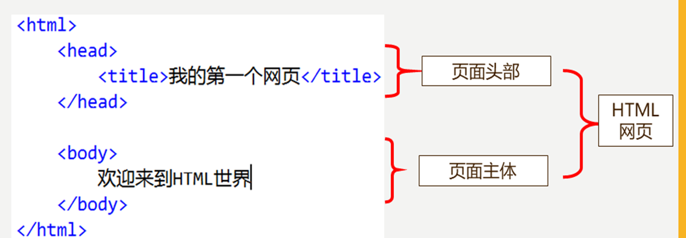

# 第一章 HTML的使用
## 1、HTML HyperText Markup Languag
### 超文本标记语言
    1. 文本
        2. 视频
        3. 音频
        4. 链接
        5. 图片

> **写给浏览器的语言**

## 2、HTML 历史

- 超文本标记语言（第一版）1993年6月（IETF制定）
- HTML 2.0——1995年11 月
- HTML 3.0——1996年1 月
- HTML 4.0——1997年
- HTML 5.0——2014年10月29日(W3C和WHATWG合作发布)
> W3C: World Wide Web Consortium 	(W3C理事会或万维网联盟)    
> WHATWG  (Web超文本应用技术工作组

## 3、HTML的组成

1. hear 头部
  - mate 用于定义编码方式，描述页面内容，关键字
  - title  标题，地址栏上面的描述
2. body 身体
 - HTML标签的主要放置点
 - 要显示的页面内容都在此

